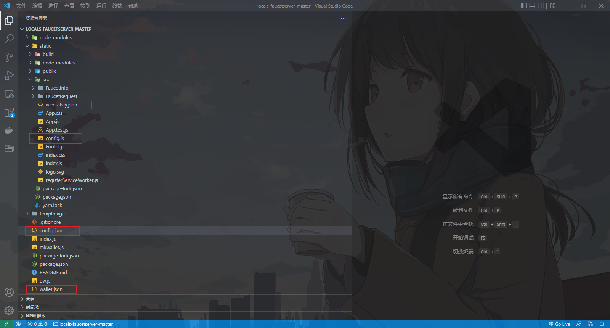

# 以太坊水龙头服务

**项目代码原地址：**https://github.com/sponnet/locals-faucetserver

由于项目时间久远，原作者貌似很久没有维护了，因此按照原项目readme操作可能出现失败的情况，所以这里记录一下自己顺利让项目跑起来的步骤    (注意：以下操作步骤不是严格地按照时间顺序先后操作的，建议先把readme读完理清操作思路再进行搭建部署)

**说明**：在进行项目搭建时，最好clone原作者项目再按照本参考readme进行配置搭建。本仓库项目代码已经进行了些许修改，但是按照下面步骤操作理论上应该也不会出现什么问题

项目大致目录以及重要的配置文件



### 一、运行环境

1. GETH 1.10.18-stable   注意：比这个版本更高的哪个版本(好像是1.10.19还是多少来着，具体版本记不得了)之后，由于挖矿算法改成了POS算法，启动节点时除了port和httpprot之外还有一个authport(默认8551？)，起多个节点时需要注意端口分配，不然可能造成端口冲突从而节点启动不了，当然，本项目运行只需一个节点就可，因此这个问题无需关注。
2. Node v12.4.0   推荐使用 nvm 进行node的版本管理
3. Npm 6.9.0

### 二、GETH节点的建议启动命令

GETH节点需要开放HTTP连接(默认8545端口)供后端连接，还要加上--allow-insecure-unlock启动选项，下面是命令示例：

```shell
nohup geth --datadir ./data --networkid 120 --port 45678 --http --http.port 11100 --http.api 'admin,net,eth,web3,personal,txpool' --http.addr "0.0.0.0" --http.corsdomain "*" --miner.gasprice 0 --mine --miner.threads=1 --miner.etherbase=0x5a5839ce81316d7fef5b82707499f66bb78741df --nodiscover --allow-insecure-unlock 1>chainId-120.log 2>&1 &
```

命令说明：--networkid根据GETH节点初始化时的genesis.json配置来修改；--port、 --http.port按需指定；--miner.etherbase是矿工地址，由于在genesis.json中指定矿工地址好像无法生效，因此在启动命令里面指定，这里将地址设置成了水龙头服务的测试币发出地址


### 三、项目本地搭建

#### 1、Installing

```shell
cd locals-faucetserver    #进入项目根目录
npm install               #安装项目后端依赖
cd static                 #进入项目前端目录
yarn build  #对项目前端进行build打包，执行之前可能需要先install依赖，原项目是将前端打包后通过后端静态资源暴露出去供用户访问的
cd ..                     #回到项目根目录
```

说明：安装依赖包时，安装过程中可能提示缺少某些依赖包：此时如果package.json或package-lock.json中有此依赖的具体版本说明，就手动安装**该版本的依赖**；没有版本说明的话，就需要自己判断安装哪一版本的依赖；

#### 2、Configuring the faucet API

2.1、项目根目录下创建钱包地址信息文件 `wallet.json`，通过执行以下命令创建

```shell
node mkwallet.js test > wallet.json       #项目根目录下执行
```

说明：生成钱包地址时，test是加密密码(最好不要改，因为后面很多地方都用到了这个密码，改的话其它地方也要做相应改变)，这个钱包地址(这里称为地址A)是**水龙头服务的测试币发出地址**，即其它地址在使用水龙头服务获取测试币时，测试币是从这个地址A中转出的。因此，需要保证水龙头服务连接的GETH节点中地址A有足够的测试币，可以在GETH节点初始化的genesis.json文件中预先给地址A分配足够的测试币。

2.2、项目根目录下手动创建后端配置文件 `config.json`，然后写入以下内容

```json
{
	"etherscanroot": "http://testnet.etherscan.io/address/",
	"payoutfrequencyinsec": 60,   //每笔交易处理等待时间
	"payoutamountinether": 0.1,   //每次领取的测试币数量
	"queuesize": 5,               //请求队列长度  
	"walletpwd": "test",          //创建 wallet.json 时的密码
    "walletpk": "xxxxxxxxxxx",    //水龙头服务支出钱包地址私钥
	"httpport": 3000,             //后端服务端口
	"web3": {
		"host": "http://<IP ADDRESS>:<HTTP.PORT>"  //GETH节点连接地址
	}
}
```

说明：

​        2.2.1、原项目readme中`config.json` 文件并没有要配置 walletpk 字段，但是通过原项目根目录下index.js文件中第15行看出，需要walletpk字段来获取钱包对象，所以这里添加了walletpk字段。钱包地址私钥信息可以通过在原项目根目录下执行以下命令获取

```shell
node walletinfo.js  wallet.json test
```

其中，`wallet.json`是创建钱包地址时生成的文件，test是创建钱包地址时指定的密码

​        2.2.2、etherscanroot字段是与项目连接的GETH节点相关联的区块链浏览器地址，如果没有搭建好区块链浏览器，etherscanroot信息不配置也没什么大问题

​        2.2.3、原项目根目录下index.js第60行左右代码

```js
var ip = req.headers["x-forwarded-for"] || req.remoteAddress;
```

需要修改成：

```js
var ip = req.headers["x-forwarded-for"] || req.socket.remoteAddress; 
```

不然可能获取不到ip地址，因为req.remoteAddress貌似无法获取ip地址

2.3、启动项目（可以在完成项目前端配置后进行启动），项目根目录下执行命令

```shell
node index.js
```

#### 3、Configuring the faucet frontend

3.1、编辑项目根目录下 `static/src/config.js` 文件(没有的话需手动创建)，配置相关信息。文件内容说明：

```js
const config = {
  apiurl: "https://localhost:3000",     //项目后端访问地址，按需修改，注意，这里不是GETH节点的连接地址
  etherscanroot: "http://ropsten.etherscan.io",    //项目GETH节点相关联的区块链浏览器地址，有则配置好
  accesskey: require("./accesskey.json").key // 生成的钱包文件 wallet.json 访问密码(test)的保存文件
};

export default config;
```

前端配置好后，在 `static/` 目录下执行  `yarn build `  命令打包，然后回到项目根目录执行 `node index.js` 即可启动项目进行访问

### 三、项目访问

浏览器访问http://localhost:3000/，因为项目是将前端页面以静态资源暴露出来的，可见项目根目录下的index.js第56行，应该是将前端打包后的目录以静态资源的方式暴露供用户访问。

### 四、项目服务器部署

部署到服务器上时，由于node启动的服务一关闭终端就会自动停止，因此推荐使用pm2来进行node服务的开启与关闭

- 查看已启动的服务：pm2 list
- 启动服务：pm2 start index.js 1>../faucetserver.log 2>&1
- 关闭服务：pm2 stop index
- 查看项目日志：pm2 log   因为没做特殊设置的话，即使在启动服务时指定日志目录，也只是将pm2自身的日志输出到该目录，而不是项目日志